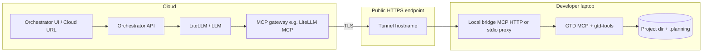

# Local forward and backward with a cloud orchestrator

> **Status:** Architecture and delivery plan (not implemented in this repo unless linked issues are completed).  
> **Audience:** Engineers integrating a **cloud-hosted orchestrator** (with LiteLLM or similar) so that **GTD** can **write** and **read** code on a **developer’s machine** behind NAT.

---

## 1. What problem this solves

| Party | Where they work | What they need |
|-------|-----------------|----------------|
| **User** | Browser or client hitting a **cloud URL** | Chat with an AI that “uses GTD” without uploading the whole repo to your servers permanently. |
| **Orchestrator** | Cloud (Kubernetes, VM, serverless front + long-lived worker) | Call **tools** (MCP) and LLMs; keep sessions and billing. |
| **Source of truth** | **Local disk** on the laptop (or office workstation) | **Forward:** generated/edited files land here. **Backward:** scans and documents reflect **this** tree and `.planning/`. |

**Gap:** The cloud cannot open `C:\Users\…` or `/home/…` on the user’s PC. **Solution:** A **tunnel** (or VPN) plus a **local agent** that runs **GTD MCP** (or `gtd-tools`) with `--project` pointing at the local repo, so tool calls that originate in the cloud **terminate on the user’s machine**.

---

## 2. Mental model (one paragraph)

The **browser talks to the cloud**. The **cloud LLM** decides to call tools. Those tool calls are **forwarded over an encrypted tunnel** to a **small process on the laptop** that runs **`gtd-mcp-server`** (or wraps `gtd-tools`) with **`cwd` = local project**. Reads and writes happen **locally**. The cloud only sees **tool request/response payloads** (and whatever you log), not direct POSIX access to arbitrary paths.

---

## 3. High-level architecture

**Important:** The stock **`gtd-mcp-server.cjs`** uses **stdio** JSON-RPC. Most cloud gateways expect **streamable HTTP** or **SSE** MCP. The plan assumes you either:

- Run a **thin adapter** on the laptop that exposes MCP over HTTP and **spawns** the stdio server internally, or  
- Extend tooling later to ship an official **HTTP MCP** entrypoint (future work).

Until then, treat “**local bridge**” as a required integration component in your product.

---

## 4. Why a tunnel (vs “just configure MCP in the cloud”)

If you register MCP on **LiteLLM in the cloud** so it runs **`node gtd-mcp-server.cjs` on the server**, then:

- `--project` refers to a path **on the server**, not the user’s laptop.  
- **Forward** and **backward** run against **cloud disk**, not local.

To reach **local disk**, something on the laptop must **listen** and the cloud must **connect outbound** to that listener. Because home networks use **NAT**, you typically:

1. Open a **tunnel** that maps `https://random-subdomain.vendor.dev` → `localhost:8741` on the laptop, or  
2. Use **Tailscale** (or corporate VPN) so cloud and laptop share a **private IP** and no public URL is needed.

This document focuses on **(1) public tunnel + auth** as the most portable pattern for “user at home, SaaS in cloud.”

---

## 5. Tunnel options (comparison)

| Option | How it works | Good for | Watch out |
|--------|----------------|----------|-----------|
| **Cloudflare Tunnel (`cloudflared`)** | Outbound connection from laptop; public hostname routes to local port | Demos, many enterprises allow Cloudflare | Account, hostname policy, rate limits |
| **ngrok** (or similar) | Same idea; vendor gives URL | Fastest POC | Cost, URL rotation, abuse policy |
| **Tailscale Funnel / HTTPS** | Machine has stable tailnet; optional public funnel | Teams already on Tailscale | ACLs, who can hit the node |
| **SSH remote port forward** | `ssh -R` from laptop to bastion; cloud hits bastion | Corporate SSH bastion | Ops burden, keepalive |
| **VPN only** | No public URL; cloud worker on same VPN as laptop | Strict no-public-surface | You must deploy orchestrator leg inside VPN |

**Recommendation for a first MVP:** **Cloudflare Tunnel** or **ngrok** plus **short-lived bearer token** checked by your local bridge.

---

## 6. Components to build or configure

| # | Component | Owner | Responsibility |
|---|-----------|-------|------------------|
| 1 | **Orchestrator UI** | You | User logs in; shows “Connect local workspace” with URL/token instructions. |
| 2 | **MCP gateway (LiteLLM)** | You / platform | Registers **per-session** or **per-user** MCP base URL pointing at tunnel + headers. |
| 3 | **Tunnel client** | User / IT | `cloudflared` or ngrok agent maps public URL → `localhost:BRIDGE_PORT`. |
| 4 | **Local bridge** | You (product) | Validates token; implements **MCP over HTTP** (or forwards to stdio); sets env `GTD_PROJECT` / passes `--project`. |
| 5 | **GTD package** | This repo | `gtd-mcp-server.cjs` + `gtd-tools` unchanged; bridge invokes them. |
| 6 | **File writer (optional)** | You | If cloud LLM must **edit files** beyond what `gtd-tools` writes: local “apply patch” worker using same auth. |

---

## 7. Step-by-step: first connection (happy path)

Numbers are **order of operations** for a pilot, not necessarily strict forever.

### Phase A — On the laptop (once per machine)

1. Install **Node 20+** and **Git**.  
2. **Clone or open** the project directory that should receive code (e.g. `~/work/acme-api`).  
3. Install GTD (`npx …` or `npm i` the package) so `gtd-mcp-server.cjs` exists.  
4. Install your **local bridge** (small service we assume you ship): e.g. `npm i -g acme-local-mcp-bridge`.  
5. Create a **project-scoped token** in the cloud UI (“Add device”) — store it only in env, e.g. `export ACME_DEVICE_TOKEN=…`.

### Phase B — Tunnel

6. Start the bridge bound to **localhost** only: `acme-bridge listen --port 8741 --project ~/work/acme-api`.  
7. Start the tunnel pointing at that port, e.g. `cloudflared tunnel --url http://127.0.0.1:8741` (exact flags depend on product).  
8. Copy the **public HTTPS URL** shown by the tunnel (e.g. `https://branch-xyz.trycloudflare.com`).

### Phase C — In the cloud (per session or per user)

9. User pastes **URL + token** into orchestrator “Connect workspace” form **or** your backend stores mapping `user_id → tunnel_url` for the session TTL.  
10. Configure **LiteLLM MCP** (or your gateway) with:  
    - **Server URL** = tunnel HTTPS origin  
    - **Headers** = `Authorization: Bearer <token>` (or `x-mcp-*` pattern per [LiteLLM MCP docs](https://docs.litellm.ai/docs/mcp)).  
11. Orchestrator starts a chat session with tools enabled (`server_url: "litellm_proxy"` where applicable).

### Phase D — First chat turn

12. User opens **cloud URL**, sends: “Run GTD scan on my connected workspace.”  
13. LLM requests tool **`gtd_scan`**.  
14. Gateway sends MCP `tools/call` **over HTTPS** → tunnel → **local bridge** → **stdio MCP child** `gtd-mcp-server.cjs --project ~/work/acme-api`.  
15. Response JSON/text returns to cloud → LLM → user.  
16. Verify on disk: `.planning/` or scan outputs appear **only under local `--project`**.

---

## 8. Forward mode — creating code locally

**GTD forward** (plan → execute) ultimately needs **file writes** in the project tree.

| Mechanism | Who writes files | Notes |
|-----------|------------------|--------|
| **MCP `gtd_execute_phase` + context only** | Your **local executor** (IDE agent, bridge-invoked LLM, or script) | Today’s GTD MCP often returns **workflow context**; something must still **apply** patches or run the IDE flow. |
| **Local Cursor / Claude Code** | IDE with GTD skills | User stays local; cloud not involved — different product mode. |
| **Hybrid** | Cloud LLM returns **unified diff**; local bridge **applies** with `git apply` or patch API | Strong audit trail; implement **idempotency** and backups. |

**Plan recommendation:** Document **two supported profiles**:

1. **Profile L1 — Tools only:** Tunnel carries **only** `gtd_*` tools; **human or local script** applies code after reviewing LLM output (safest MVP).  
2. **Profile L2 — Auto-apply:** Local bridge adds **`apply_patch`** tool that writes under `--project` with **path allowlist** and **max bytes** per call.

---

## 9. Backward mode — reading local code and generating documents

Backward needs **read access** to the same tree.

1. **`gtd_scan` / `gtd_analyze`** — executed locally; they read files under `--project` (respecting `.gitignore` as implemented).  
2. **`gtd_create_document` / `gtd_create_all`** — still produce artifacts under **local** `.planning/documents/` (or equivalent).  
3. **`gtd_read_document`** — returns content from **local** `.planning/`.  
4. **User views docs** — open Markdown locally, or your UI **streams** file contents via another authenticated API that reads the same folder (out of scope for GTD core).

**Key point:** No extra “download step” if the tunnel is up — **documents already exist locally**.

---

## 10. Security checklist (do not skip)

- [ ] **TLS end-to-end** (tunnel vendor + HTTPS to bridge).  
- [ ] **Bearer token** or mTLS; **rotate** per session where possible.  
- [ ] **Bind bridge to 127.0.0.1** — never `0.0.0.0` on untrusted networks without firewall.  
- [ ] **Path jail:** bridge refuses `--project` outside an allowlisted root or symlink-escape hardened.  
- [ ] **Rate limit** tool calls per token.  
- [ ] **Logging:** never log full file contents or tokens.  
- [ ] **Kill switch:** user can revoke token and stop tunnel from UI.  
- [ ] **Prompt injection:** cloud LLM could request destructive tools — enforce **tool allowlists** per product policy.

---

## 11. Failure modes and what the user sees

| Symptom | Likely cause | Mitigation |
|---------|--------------|------------|
| Tool timeout | Tunnel dropped, laptop sleep | Reconnect UI; heartbeat; wake lock guidance |
| 401 from bridge | Wrong or expired token | Re-issue token; show clock skew notice |
| Empty scan | Wrong `--project` | Bridge UI shows resolved absolute path before connect |
| Partial writes | Auto-apply race | Serialize writes per session; use temp files + atomic rename |
| “Works on my machine” only | Corporate proxy blocks tunnel | Offer VPN profile (Section 5) |

---

## 12. LiteLLM-specific notes

- Register MCP servers per [LiteLLM MCP documentation](https://docs.litellm.ai/docs/mcp); supports **HTTP**, **SSE**, **stdio** (stdio runs **on the proxy host** — not your laptop — unless the proxy process itself is local).  
- For **cloud LiteLLM → laptop**, prefer **HTTP MCP** on the laptop side (behind tunnel).  
- Use **`x-mcp-{alias}-{header}`** style headers to pass the device token if required by your bridge.

---

## 13. Delivery phases (for your product roadmap)

| Phase | Outcome |
|-------|---------|
| **P0** | Document + mock: cloud calls **fake** MCP on server; proves LLM loop only. |
| **P1** | Local bridge + tunnel + **read-only** tools (`gtd_status`, `gtd_read_document`). |
| **P2** | **Full backward** (`gtd_scan`, `gtd_analyze`, `gtd_create_document`) on local disk. |
| **P3** | **Forward** with L1 (human apply) or L2 (auto-apply) policy. |
| **P4** | Hardening: audit logs, enterprise VPN path, on-prem LiteLLM option. |

---

## 14. How this relates to other plans

- **[HOLISTIC_PLAN.md](./HOLISTIC_PLAN.md)** — If execution runs in a **cloud sandbox** instead of the laptop, use that loop; use **this** plan when the runtime stays **on the developer machine** (tunnel).  
- **[VOLUME_USAGE.md](../VOLUME_USAGE.md)** — If the “laptop” is actually a **Docker** dev container, use a **volume** for the same project path the bridge passes to `--project`.  
- **[GIT_UPGRADE_PLAN.md](./GIT_UPGRADE_PLAN.md)** — After local forward work, **push** to a remote with a dedicated git-publish flow.  
- **[CUSTOM-INTEGRATION-GUIDE.md](../CUSTOM-INTEGRATION-GUIDE.md)** — SDK, MCP, and custom orchestrator patterns without tunnel.

---

## 15. Summary

| Question | Answer |
|----------|--------|
| Can a cloud URL orchestrator drive **local** GTD? | **Yes**, with a **tunnel + local bridge** that terminates MCP and runs **`gtd-mcp-server --project …`**. |
| Does GTD need changes day one? | **Not necessarily**; the **bridge** is the main new component. Optional future: first-party HTTP MCP. |
| Forward + backward local? | **Yes**, both are “run tools locally”; forward may still need an **apply** strategy (Section 8). |

When you implement the bridge, add a **short “Connect local workspace”** user guide and link it from your orchestrator README; keep this file as the **engineering plan** reference.
