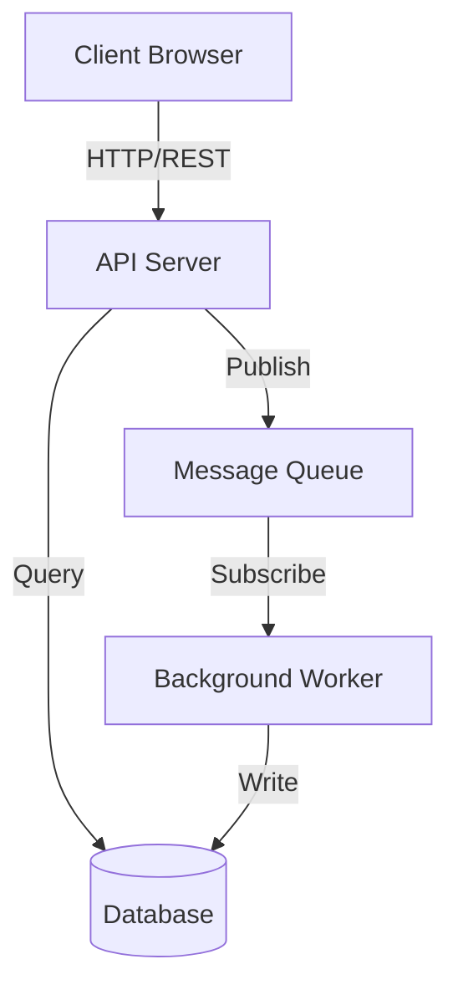
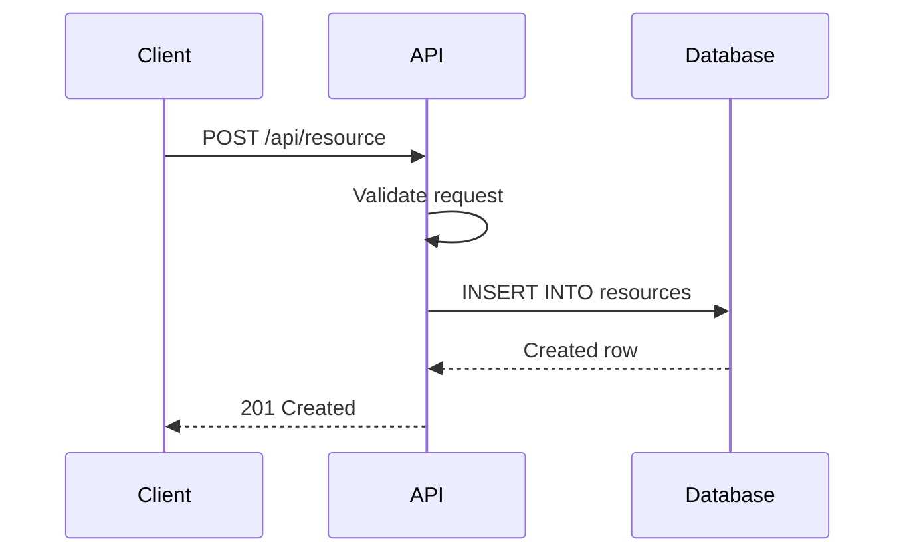
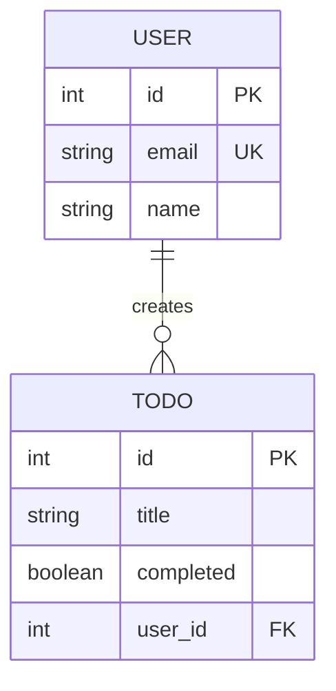

# Diagram Conventions Reference

> Mermaid diagram style guide for consistent visual output.
> Used by all writer agents and the diagram generator agent.

---

## Diagram Types and Usage

| Diagram Type | Mermaid Syntax | Use For |
|-------------|---------------|---------|
| Architecture | `graph TD` | Component hierarchy, layer diagrams |
| Data Flow | `sequenceDiagram` | Request lifecycle, API calls, event flow |
| Entity Relationship | `erDiagram` | Database schema, data models |
| Deployment | `graph LR` | Infrastructure, service topology |
| State Machine | `stateDiagram-v2` | Pipeline states, workflow states |
| Process | `flowchart LR` | Pipelines, CI/CD flows, build chains |

## Style Rules

### Node Naming
```
- Use PascalCase for components: [WebServer], [Database], [AuthService]
- Use lowercase for actions: (validate), (transform), (persist)
- Use ALL_CAPS for external systems: [AWS_S3], [REDIS], [POSTGRES]
```

### Edge Labels
```
- Always label edges with the interaction type
- Use verbs: "calls", "reads", "writes", "publishes", "subscribes"
- Include protocol where relevant: "HTTP/REST", "gRPC", "WebSocket"
```

### Size Limits
```
- Maximum 15 nodes per diagram
- Maximum 20 edges per diagram
- If larger, split into overview + detail diagrams
- Overview shows top-level components
- Detail shows internals of one component
```

## Templates

### Architecture Diagram


### Sequence Diagram


### ER Diagram


---

*End of Diagram Conventions Reference*
